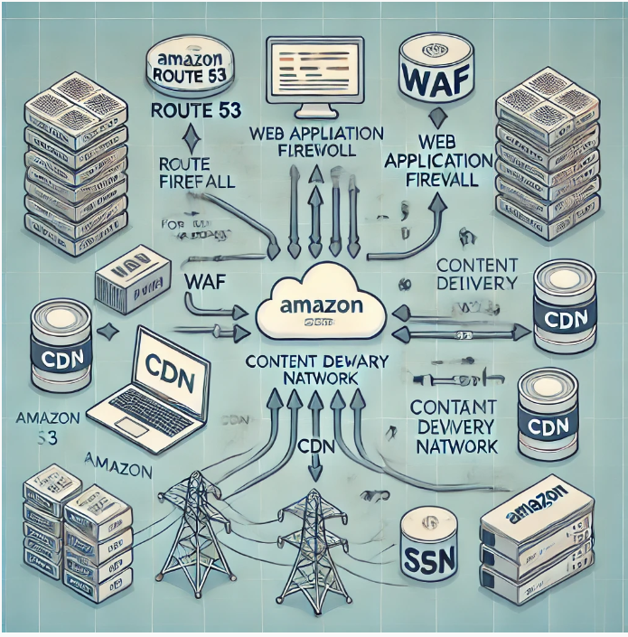

<!-- TOC -->

- [Introduction](#introduction)
- [What it does?](#what-it-does)
- [Architecture](#architecture)
- [How to use it](#how-to-use-it)
- [How to use it in tekton pipeline](#how-to-use-it-in-tekton-pipeline)
- [webui-deployment](#webui-deployment)
    - [To test certificate stack](#to-test-certificate-stack)
        - [first build the  test template](#first-build-the--test-template)
        - [verify , deploy and test](#verify--deploy-and-test)
    - [To test custom resource stack](#to-test-custom-resource-stack)
        - [first build the  test template](#first-build-the--test-template)
        - [verify , deploy and test](#verify--deploy-and-test)
    - [To test cloudfront stack](#to-test-cloudfront-stack)
    - [To test the route53 stack](#to-test-the-route53-stack)
        - [first build the  test template](#first-build-the--test-template)
        - [verify , deploy and test](#verify--deploy-and-test)
    - [How to do the complete stack test](#how-to-do-the-complete-stack-test)
        - [first build the  Main template](#first-build-the--main-template)
        - [verify , deploy and test](#verify--deploy-and-test)
        - [Pipeline implementation](#pipeline-implementation)
    - [Manually Cleaup the stack](#manually-cleaup-the-stack)
    - [deploying any UI with this scripted automation](#deploying-any-ui-with-this-scripted-automation)

<!-- /TOC -->
# Introduction 

Use this atomated solution to deploy any full fledge front end(static site / SPA / PWA complete Website etc) in AWS. In the solution we just specify a config file with all data pertaining to the Organization / Department /  Account (Landing Zone) ... etc and it will create the entire stack with AWS cloudformation.We use Tekton as our CI/CD platform , so I also write some tekton jobs so that the sites can be deployed via tekton. The automation script take care of self discovery of the stack after deployment and we can query the AWS cloudformation stack and get every metadata about the stack you create and you could use that data for any stack that act as a cloud control plane.

# What it does?

-   It create secure S3 storage & all rules etc for hosting
-   The Build Website content is pushed to S3
-   The Secure certificate etc is created for the Site
-   Then it creates the CDN layer with the certificate.
-   It applies CloudFront Response Header Policies to add security headers to every server response
-   Then it update the CDN endpoint with route 53 domain for public access
-   Then it can create a soft waf layer to protect the site.

# Architecture 

# How to use it

We have made this script a generic to deploy any UI , given the UI repo location. To deploy the UI, you need to pass on the deployment config to a config.yaml. A example config.yaml is given.
To deploy
./depoly.sh -c config.yaml.

For example , for ptr website deployment , we added ptr-website-config.yaml.
To deploy the ptr-website , all u need to do is

./depoly.sh -c ptr-website-config.yaml.

Note: We assume that you will configure the proper AWS context( either through role arn or access key / secret keys) before running the deploy.sh script.

# How to use it in tekton pipeline 

To deploy the UI repeatedly in tekton , please use the following tasks.

https://raw.githubusercontent.com/ptrsoft/ptr-tekton-automation/refs/heads/main/tasks/ptr-standalone-ui.yaml

For different Application UI deployment i Have writted few build pipelines as follows:

https://raw.githubusercontent.com/ptrsoft/ptr-tekton-automation/refs/heads/main/pipelines/ecom-b2c-sui-deployment.yaml

# webui-deployment
Automated secure static web UI deployment
## To test certificate stack 
###  first build the  test template
aws --region us-east-1 cloudformation package \
    --template-file templates/acm-certificate-test.yaml \
    --s3-bucket cf-static-secure-site-promodeagro \
    --output-template-file packaged.template

### verify , deploy and test
aws cloudformation validate-template --template-body file://packaged.template

aws --region us-east-1 cloudformation deploy \
    --stack-name certificate-test \
    --template-file  packaged.template \
    --capabilities CAPABILITY_NAMED_IAM CAPABILITY_AUTO_EXPAND \
    --parameter-overrides  DomainName=promodeagro.com.com SubDomain="" CreateApex=yes \
    HostedZoneId=Z00062013820EO6BYULDB \
    AppkubeDepartment=promodeagro AppkubeProduct=website AppkubeEnvironment=prod AppkubeService=ui

## To test custom resource stack 
###  first build the  test template
aws --region us-east-1 cloudformation package \
    --template-file templates/custom-resource-test.yaml \
    --s3-bucket cf-static-secure-site-ptr \
    --output-template-file packaged.template
### verify , deploy and test
aws cloudformation validate-template --template-body file://packaged.template

aws --region us-east-1 cloudformation deploy \
    --stack-name custom-resource-test \
    --template-file  packaged.template \
    --capabilities CAPABILITY_NAMED_IAM CAPABILITY_AUTO_EXPAND \
    --parameter-overrides  AppkubeDepartment=ops AppkubeProduct=ptrcloud \
    AppkubeEnvironment=prod AppkubeService=ui
Note:- make sure that parameters are in lower case , otherwise bucket name is not accepted as uppercase.

## To test cloudfront stack 
This stack is highly dependent on certificate and custom resource stack , so its difficult to test it independently, so ignoring this stack test. The main test should suffice.

## To test the route53 stack 

###  first build the  test template
aws --region us-east-1 cloudformation package \
    --template-file templates/route53-update-test.yaml \
    --s3-bucket cf-static-secure-site-ptr \
    --output-template-file packaged.template
### verify , deploy and test
aws cloudformation validate-template --template-body file://packaged.template

aws --region us-east-1 cloudformation deploy \
    --stack-name route53-update-test \
    --template-file  packaged.template \
    --capabilities CAPABILITY_NAMED_IAM CAPABILITY_AUTO_EXPAND \
    --parameter-overrides  AppkubeDepartment=ops AppkubeProduct=ptrcloud \
    AppkubeEnvironment=prod AppkubeService=ui \
    HostedZoneId=Z06401662L0WAGUZJFQOF CDNDomain="dlr31o9u647ea.cloudfront.net" DomainName=ptrtechnology.com SubDomain=ptrcloud

## How to do the complete stack test

###  first build the  Main template
aws --region us-east-1 cloudformation package \
    --template-file main.yaml \
    --s3-bucket cf-static-secure-site-ptr \
    --output-template-file packaged.template
### verify , deploy and test
aws cloudformation validate-template --template-body file://packaged.template

aws --region us-east-1 cloudformation deploy \
    --stack-name ops-appkube-ptrcloud-ui \
    --template-file  packaged.template \
    --capabilities CAPABILITY_NAMED_IAM CAPABILITY_AUTO_EXPAND \
    --parameter-overrides  DomainName=ptrtechnology.com SubDomain=ptrcloud CreateApex=no HostedZoneId=Z06401662L0WAGUZJFQOF \
    AppkubeDepartment=ops AppkubeProduct=ptrcloud AppkubeEnvironment=prod AppkubeService=ui \
    --disable-rollback

Note:- make sure that parameters are in lower case , otherwise bucket name is not accepted as uppercase. Also when u build the template , if u are not using S3 target location , template will not work.

### Pipeline implementation
This repos contains cloudfromation code which does full stack cleanup & deployment for UI service. For update we sync latest build artifacts to s3 bucket and invalidate cloudfront
	
    Based on "cleanup-cloudformation" parameter
    this pipeline will do UI deployment in AWS cloudformation or 
    sync deployment files to s3 bucket and invalidate cloudfront 
    This pipeline will do the following steps:
      - Using the git-clone catalog Task to clone the UI source Code
      - It will do build the UI code , and create the deployment artifacts that need to be copied to S3
      when "cleanup-cloudformation" parameter is true
      - Then it will git clone the deployment source code 
      - It will copy the build artifacts into the www folder in deployment workspace.
      - It will then invoke the cloud formation template using aws cli
    when "cleanup-cloudformation" parameter is false
      - sync UI code to s3 bucket
      - Run cloudfront invalidation
## Manually Cleaup the stack
The stack stucki in delete because pf certain bucket cant be deleted , following scripts help in delete the stack..
aws s3 rm s3://ops-ptrcloud-prod-ui-root --recursive
aws s3 rm s3://ops-ptrcloud-prod-ui-log --recursive
aws s3 rm s3://ops-ptrcloud-prod-ui-root --recursive
aws s3api delete-bucket --bucket ops-ptrcloud-prod-ui-root
aws s3api delete-bucket --bucket ops-ptrcloud-prod-ui-log

## deploying any UI with this scripted automation

Now we have made this script a generic to deploy any UI , given the UI repo location. To deploy the UI, you need to pass on the deployment config to a config.yaml. A example config.yaml is given.
To deploy
./depoly.sh -c config.yaml.

For example , for ptr website deployment , we added ptr-website-config.yaml.
To deploy the ptr-website , all u need to do is

./depoly.sh -c ptr-website-config.yaml.